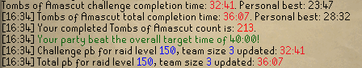
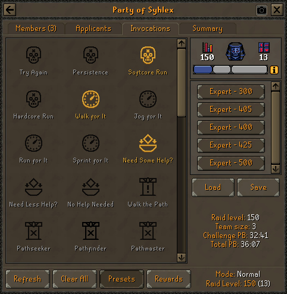

# ToA PB Tracker

This plugin keeps a record of your best completion times for Tombs of Amascut (ToA), tracking both challenge and total
completion times across different raid levels and team sizes.

Upon completing a raid, this plugin automatically checks if your challenge or total completion time is a personal best
for that specific raid level and team size, and updates its records accordingly.

In the ToA lobby interface, a new section is added in the Invocations tab showcasing your personal best times
for the raid that your party is about to undertake.

